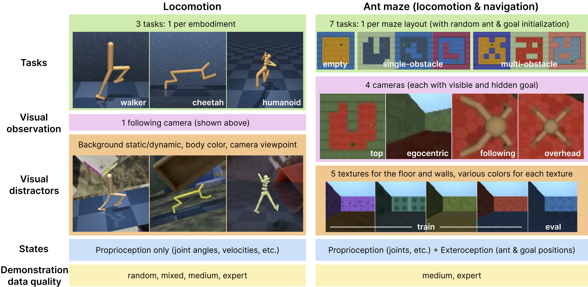
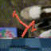
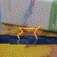
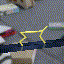
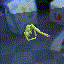
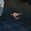
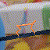
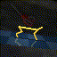
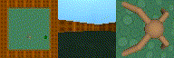
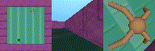

<h1 align="center">
  DeepMind Control Vision Benchmark (DMC-VB)
<br/>
  <sup>A Benchmark for Representation Learning for Control with Visual Distractors</sup>
</h1>

<!-- # DeepMind Control Vision Benchmark (DMC-VB)
## A Benchmark for Representation Learning for Control with Visual Distractors -->

DMC-VB is designed to evaluate and benchmark representation learning methods for control in environments with visual distractors.
Below is a visual overview of the dataset.

<div align="center">
  
</div>


## Dataset

The dataset consists of episodes collected for 3 locomotion tasks and 7 ant maze (locomotion + navigation) tasks in environments based on the DM Control Suite.
See the accompanying paper for full details on the dataset.
Below we show some sample videos of trajectories from the dataset.

#### Locomotion tasks

Each column shows a different locomotion task (different embodiment) and each row shows data collected with a different behavioral policy skill level.
In each cell, the first video is without distractors, the second is with static distractors and the third is with dynamic distractors.
Each video in the table is a single episode from a different data subset, corresponding to a given embodiment, behavioural policy level and distractor configuration.
Each of the 36 data subsets contains 2000 episodes (or 1M steps).

| | Walker |  Cheetah | Humanoid |
| --| -- | -- | -- |
Expert |    |    |   
Medium |    |    |   
Mixed |    |    |   
Random |    |    |   

#### Ant maze tasks

There are 7 different ant maze tasks, each corresponding to a different maze layout.
Below, we show trajectories from 3 tasks, one for each maze difficulty level in each column.
For all ant maze tasks, the visual variation is present in the dataset through 4 different textures for the floor and walls, each with different colors.
See the the overview image at the top for the 7 maze layouts and the different floor and wall textures.
Again each data subset contains 1M steps.


| | Empty |  Single-obstacle (x3) | Multi-obstacle (x3) |
| --| -- | -- | -- |
Expert |  |  | 
Medium |  |  | 

## Installation

This release enables you to reproduce the results from our paper, and to derive
the performance of the different methods we evaluate on our released [DMC-VB dataset](https://console.cloud.google.com/storage/browser/dmc_vision_benchmark).

For each method, training should take approximately 1 day on a GPU instance with 16GB of memory.

The following instructions explain how to download the repository, the datasets,
set up the pip package, and run a minimal script.

### Download the Repository

First, download the `dmc_vision_benchmark` repository from GitHub:

```bash
$ DMC_VIS_BENCH_DIR=~/dmc_vision_benchmark
$ git clone git@github.com:google-deepmind/dmc_vision_benchmark.git $DMC_VIS_BENCH_DIR
```

### Download the datasets

Next, download the dataset stored in the [dmc_vision_benchmark GCP bucket](https://console.cloud.google.com/storage/browser/dmc_vision_benchmark).
You will need the gcloud CLI, which you can install by following the
[instructions here](https://cloud.google.com/sdk/docs/install).
The dataset is ~300GB.

```bash
$ DATA_DIR=/tmp/dmc_vision_bench_data
$ mkdir $DATA_DIR
$ gcloud storage cp -r gs://dmc_vision_benchmark $DATA_DIR
```

If you change `$DATA_DIR`, please adjust the paths in the
[config file](https://github.com/google-deepmind/dmc_vision_benchmark/blob/main/dmc_vision_benchmark/rep_learn/config.py).
You would need to adjust `config.data.dataset_dir` and
`config.online_eval.background_dataset_path`.

### Install the pip Package
We provide a pip-installable package that includes code for training and
evaluating models.

>Tip: **_Virtualenv Setup:_**  While you can install dmc_vision_benchmark in your standard
python environment, we strongly recommend using a Python virtual environment to
manage your dependencies. This should help to avoid version conflicts and just
generally make the installation process easier.
>
```bash
$ cd $DMC_VIS_BENCH_DIR
$ python3.11 -m venv env
$ source env/bin/activate
```
>
> There are many other options for Python virtual environments, including
(mini)conda. Conda is useful if, for instance, you can't install python 3.11,
or your project has non-python dependencies (some
[setup help](https://docs.anaconda.com/free/miniconda/#quick-command-line-install);
and you can create environments with specific python versions by
`conda create -y --name dmc_vis_bench_env python=3.11`)

Next, pip install `dmc_vision_benchmark`, followed by an additional [package](https://github.com/google-research/google-research) from
github. The `-e` flag keeps package scripts in the original directory, so you
can edit code easily.

```bash
$ pip install -e $DMC_VIS_BENCH_DIR
$ bash $DMC_VIS_BENCH_DIR/install_distracting_control.sh
```

## Getting Started
Once the package is installed, you should be able to run the minimal example
script:

```bash
$ python $DMC_VIS_BENCH_DIR/example/example.py
```

This invokes the `dmc_vision_benchmark.rep_learn.train.Trainer` object. Please
refer to the `train` method to understand the training / evaluation process.
Configurations for training are defined in
`dmc_vision_benchmark/rep_learn/config.py`. It defaults to training by
behavioral cloning.

## Agents implemented

Our `Trainer` module in `dmc_vision_benchmark/rep_learn/train.py` supports the following policies:

* `bc` jointly trains the visual encoder and the policy network with behavioral cloning (BC) on pixel observations.

* `bc_on_state` jointly trains the state encoder and the policy network with BC on states.

* `bc_w_frozen_encoder` trains the policy network with BC on pixel observations, using a frozen pretrained visual encoder.

* `td3_bc` jointly trains the visual encoder and the policy network with TD3-BC on pixel observations.

* `td3_bc_on_state` jointly trains the state encoder and the policy network with TD3-BC on states.

* `td3_bc_w_frozen_encoder` trains the policy network with TD3-BC on pixel observations, using a frozen pretrained visual encoder.

### Visual encoder network

In addition, we support the following representation learning methods to pretrain the visual encoder:

* `id_pretrain` learns the visual encoder with an inverse dynamics model.

* `lfd_pretrain` learns the visual encoder with a latent forward model.

* `ae_pretrain` learns the visual encoder with an autoencoder.

* `state_pretrain` learns the visual encoder with a state prediction loss.

### Decoder networks

Given a pretrained visual encoder, our `DecoderTrainer` module in `dmc_vision_benchmark/rep_learn/train_decoder.py` allows the user to inspect the learned representations:

* `obs_decoder` trains a network to reconstruct the pixel observations.

* `state_decoder` trains a network to reconstruct the states.

## Benchmarks

We additionally include 3 minimal scripts in the `example` folder to mimic the 3 benchmark experiments in our paper.
Each script only performs one training step and one evaluation step for each method.

As longer runs are required to reproduce our results, we encourage the user to parallelize the different runs on their hardware.

* `benchmark1.py` studies whether visual representation learning makes policies robust to distractors (on locomotion and ant maze datasets).

* `benchmark2.py` investigates whether visual representations pretrained on mixed quality data improve policy learning with limited expert data (on locomotion datasets).

* `benchmark3.py` explores whether visual representations pretrained on tasks with stochastic hidden goals improve policy learning with fixed hidden goal and limited expert data (on ant maze datasets).

## Troubleshooting
`dmc_vision_benchmark` uses [MuJoCo](https://mujoco.org/) for physics simulation
with OpenGL rendering. Rendering on a headless server can be problematic - as
the display driver doesn't know where to render pixels to. Thankfully there are
workarounds. A common one is to use Xvfb - an in-memory display server - with an
X11 server:

```bash
# first start the Xvfb - in-memory display server
$ export DISPLAY=":1"
$ export __GL_SYNC_TO_VBLANK="0"
$ export __NV_PRIME_RENDER_OFFLOAD="1"
$ SIZEW=1280 SIZEH=720 DEPTH=24 DPI=96
$ Xvfb "${DISPLAY}" -ac -screen "0" "${SIZEW}x${SIZEH}x${DEPTH}" -dpi "${DPI}" \
      +extension "RANDR" +extension "GLX" +iglx +extension "MIT-SHM" +render \
      -nolisten "tcp" -noreset -shmem &

# Now that we have an in-memory display server, connect to the X11 server
# (you can add these lines to ~/.bashrc so it connects to X11 on every login)
$ export DISPLAY=":1"
$ until [[ -S "/tmp/.X11-unix/X${DISPLAY/:/}" ]]; do sleep 1; done
```

If you see OpenGL errors like
`OpenGL context has not been created before mjr_makeContext was called`, it is
might be helpful to call the python script directly with `xvfb`:

```bash
$ xvfb-run python $DMC_VIS_BENCH_DIR/example/example.py
```

If you use `dmc_vision_benchmark` with (mini)conda, you might get errors like
`MESA-LOADER: failed to open zink: /usr/lib/dri/zink_dri.so`, or
`mujoco.FatalError: gladLoadGL error`. If so, try installing `libstdcxx-ng`:

```bash
$ conda install -c conda-forge libstdcxx-ng
```


## Citing this work

To cite this work, please use the citation:

```bibtex
@article{dmcvb2024,
      title={DMC-VB: A Benchmark for Representation Learning for Control with Visual Distractors},
      author={Ortiz, Joseph and Dedieu, Antoine and Lehrach, Wolfgang and Guntupalli, J Swaroop and Wendelken, Carter and Humayun, Ahmad and Zhou, Guangyao and Swaminathan, Siva and L{\'a}zaro-Gredilla, Miguel and Murphy, Kevin},
      year={2024},
}
```


## License and disclaimer

Copyright 2024 DeepMind Technologies Limited

All software is licensed under the Apache License, Version 2.0 (Apache 2.0);
you may not use this file except in compliance with the Apache 2.0 license.
You may obtain a copy of the Apache 2.0 license at:
https://www.apache.org/licenses/LICENSE-2.0

All other materials are licensed under the Creative Commons Attribution 4.0
International License (CC-BY). You may obtain a copy of the CC-BY license at:
https://creativecommons.org/licenses/by/4.0/legalcode

Unless required by applicable law or agreed to in writing, all software and
materials distributed here under the Apache 2.0 or CC-BY licenses are
distributed on an "AS IS" BASIS, WITHOUT WARRANTIES OR CONDITIONS OF ANY KIND,
either express or implied. See the licenses for the specific language governing
permissions and limitations under those licenses.

## Note

This is not an officially supported Google product.
